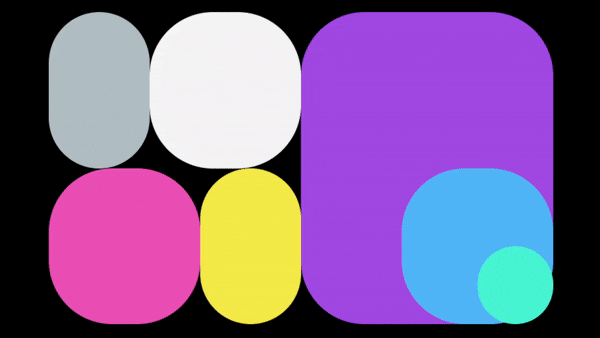

# Abel Display

Abel Display is a WordPress plugin that allows you to display posts based on specific categories and tags, with a customizable display style. It is designed to be both easy to use and highly customizable, making it perfect for a wide range of use cases.

A comprehensive guide on how this plugin was built can be found at [AJPartnersLtd](https://www.ajpartnersltd.com/building-a-wordpress-gutenberg-block-plugin-a-revised-guide/).

## Below is what is displayed when installing the plugin

## Features

- Display posts based on selected categories and/or tags
- Choose from multiple display styles
- Customize the appearance of the displayed posts
- Automatic updates when category or tag selection changes

## Installation

1. Download the plugin files from the [repository](https://github.com/animasoul/abel-display).
2. In your WordPress admin panel, navigate to **Plugins > Add New > Upload Plugin**.
3. Click on **Choose File** and select the downloaded plugin files (in .zip format).
4. Click **Install Now**.
5. After the plugin has been installed, click **Activate Plugin**.

## Usage

1. Once the plugin is activated, navigate to your WordPress post or page editor.
2. Click on the **Add Block** button and search for "Abel Display".
3. Select the Abel Display block and add it to your post or page.
4. Customize the block settings, such as the categories, tags, and display style.
5. Save or publish your post or page, and the selected posts will be displayed according to your specified settings.

## For Developers

To set up the development environment and contribute to the project, follow these steps:

1. Clone the repository to your local machine.
2. Navigate to the plugin directory in the terminal/command prompt.
3. Run `npm install` to install the required dependencies.
4. Use the following npm scripts for development tasks:

   - `npm start`: Starts the development server for live reloading and watching for changes.
   - `npm test`: Runs the tests using the Jest testing framework.
   - `npm run build`: Builds the production-ready version of the plugin.
   - `npm run lint`: Runs the linter (ESLint and stylelint) to check for code style issues.

## Contributing

If you'd like to contribute to the development of this plugin, please feel free to submit issues, pull requests, or suggestions to the project's [repository](https://github.com/animasoul/abel-display). We encourage and appreciate all contributions.

## Acknowledgements

The Abel Display project was inspired by the following websites:
- [Karina Sirqueira](https://karinasirqueira.com/)
- [Hyperplexed on CodePen](https://codepen.io/Hyperplexed/pen/poVpKdQ)

## Learn More

To learn more about Gutenberg blocks and WordPress plugin development, consider the following resources:

- [WordPress Block Editor Handbook](https://developer.wordpress.org/block-editor/)
- [Gutenberg Times](https://gutenbergtimes.com/)
- [Create Guten Block Toolkit](https://github.com/ahmadawais/create-guten-block)

## License

Abel Display is released under the [GPLv2 or later license](https://www.gnu.org/licenses/gpl-2.0.html).
